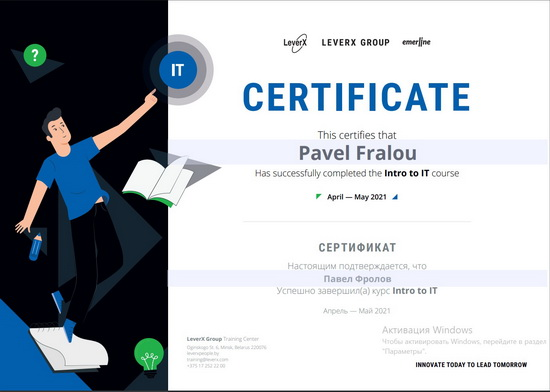

# Pavel Fralou


## Contacts

- **Location:** Gomel, Belarus
- **Phone:** +375293233575s
- **Discord:** frolixMan#3099
- **e-mail:** frolovpo@gmail.com

## About Me
I am sociable, polite, tactful, teaching, I achieve my goals. Graduated from high school with a red diploma. I am able to work in a team and manage it. Organized events for more than 400 guests, with the involvement of contractors from Belarus and Russia. I have a lot of experience working in front of an audience.

## Skills
- Git
- Java Core

## Code Example
```
function vowelOne(s){
   const vowelArr = ['A', 'E', 'I', 'O', 'U', 'a', 'e', 'i', 'o', 'u'];
    return s.split('').reduce((acc, volume) => acc + (vowelArr.includes(volume) ? '1' : '0'), '');
}
```
## Work Experience
RS School project  - Travel
https://rolling-scopes-school.github.io/frolixman-JSFEPRESCHOOL2022Q2/travel/

## Courses
- Epam, Introduction to Java Online
- LeverX Group, Intro to IT:



## Languages:
- Russian - Native
- English - B1
- German - A1